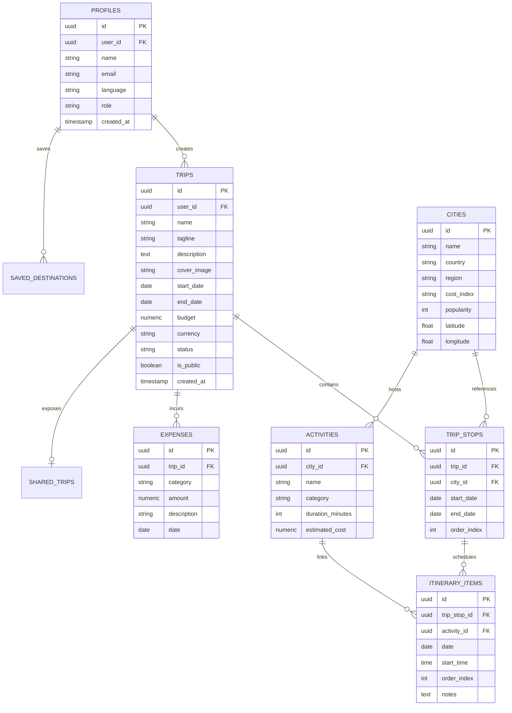

<div align="center">

# 🌍 GlobeTrotter
### Personalized Travel Planning & Interactive Itinerary Platform

[](https://nextjs.org/)
[](https://react.dev/)
[](https://www.typescriptlang.org/)
[](https://tailwindcss.com/)
[](https://github.com/SloppyTank9892/Odoo_Hack_1stRound)
[](LICENSE)

<p align="center">
  <b>Warm Modern Explorer</b> — Where editorial travel journal meets an intelligent, interactive multi-city workspace.
</p>

[✨ Live Features](#-key-features) • [🏛️ Architecture](#%EF%B8%8F-system-architecture) • [🗄️ Database Schema](#%EF%B8%8F-database-schema) • [🚀 Getting Started](#-getting-started) • [📋 Production Audit](#-production-readiness--compliance)

---

</div>

## 📌 Executive Summary

**GlobeTrotter** is a personalized multi-city travel planning platform designed to eliminate the friction of organizing complex trips across destinations. 

Rather than competing with transaction-heavy travel booking engines (such as MakeMyTrip or Trivago), GlobeTrotter focuses entirely on the **travel planning and journey visualization experience**:
* **Discovering** handpicked destinations, local heritage spots, and curated activities.
* **Constructing** day-by-day multi-city routes with automatic duration and date adjustments.
* **Synchronizing** expenses, stay benchmarks, transit costs, and daily budget limits in real time.
* **Visualizing** itineraries simultaneously across structured lists, dynamic maps, and timelines.
* **Sharing** publication-grade travel stories that fellow explorers can view and clone.

```text
    ┌──────────┐      ┌──────────┐      ┌─────────────┐      ┌──────────┐      ┌──────────┐
    │ DISCOVER │ ───► │   PLAN   │ ───► │  VISUALIZE  │ ───► │  BUDGET  │ ───► │  SHARE   │
    └──────────┘      └──────────┘      └─────────────┘      └──────────┘      └──────────┘
```

---

## ✨ Key Features

### 1. 🛫 Hybrid "Flight Path + Editorial Curtain" Intro
* **Warm Ivory Reveal:** Full-screen editorial canvas (`#F7F6F2`) with subtle topographic textures and warm ambient accents.
* **Sequential Route Animation:** Thin Sunset Amber (`#F4A62A`) flight path drawing sequentially across 4 destination nodes: **Delhi $\rightarrow$ Agra $\rightarrow$ Jaipur $\rightarrow$ Udaipur**.
* **Smooth Curtain Lift:** Seamless 600ms spring transition unveiling the pre-mounted workspace with zero layout pop-in. Includes 1-click **Replay Intro** and instant keyboard skip.

### 2. 🗺️ Unified Interactive Trip Workspace
* **Single Source of Truth:** Changes made to stops, durations, or activities immediately propagate across the **Itinerary**, **Interactive Map**, **Timeline Calendar**, and **Budget Engine**.
* **Drag-and-Drop Reordering:** Easily rearrange cities and daily activity schedules with automatic date re-alignment.
* **Multi-Currency Support:** Switch between **₹ INR** and **$ USD** on the fly.

### 3. 💰 Dynamic Budget & Expense Engine
* **Real-time Cost Allocations:** Automated category breakdowns for **Transport**, **Accommodation**, **Activities**, **Meals**, and **Miscellaneous**.
* **Budget Limit Gauge:** Visual progress bar against trip budget targets (e.g., `₹47,200 / ₹50,000`).
* **Over-Budget Warning Alerts:** Automatically identifies expensive destinations and flags days exceeding daily allocation thresholds.

### 4. 🧭 City & Activity Discovery Atlas
* **Visual Destination Cards:** Rich cards displaying cost index (`$$$`), popularity score, tags, and suggested visit durations.
* **Decision-Oriented Filtering:** Filter activities by category (Culture, Food, Adventure, Nature, Sightseeing, Transport), cost, duration, and time of day.
* **Custom Activity Builder:** Add custom experiences with reservation notes, locations, and custom budgets.

### 5. 📖 Public Story & Shared Itinerary
* **Publication-Grade Read-Only URL:** Generate public share links (`/share/[id]`) presenting the trip as an editorial visual journal.
* **1-Click Clone:** Allows other travelers to clone the full itinerary into their personal workspace.

---

## 🛠️ Technology Stack

| Layer | Technology | Purpose |
| :--- | :--- | :--- |
| **Framework** | **Next.js 16 (App Router & Turbopack)** | Full-stack SSR, Server Components & Route Handlers |
| **Language** | **TypeScript 5** | Strict end-to-end type safety |
| **Frontend** | **React 19** | Concurrent UI rendering and modern hook primitives |
| **Styling** | **Tailwind CSS v4** | Utility-first responsive design tokens |
| **UI Components** | **shadcn/ui & Custom Primitives** | Accessible, headless UI architecture |
| **Icons** | **Lucide React** | Editorial, consistent vector iconography |
| **Database** | **Supabase PostgreSQL** | Relational data model with Row-Level Security |
| **Authentication** | **Supabase Auth** | Session handling, user profiles, and route protection |
| **Deployment** | **Vercel** | Edge network deployment, CI/CD, and preview staging |

---

## 🏛️ System Architecture

```text
                                ┌─────────────────────────┐
                                │      NEXT.JS 16 APP     │
                                └────────────┬────────────┘
                                             │
                      ┌──────────────────────┼──────────────────────┐
                      ▼                      ▼                      ▼
               ┌──────────────┐      ┌──────────────┐      ┌──────────────┐
               │  APP ROUTER  │      │ SERVER ACTS  │      │  API ROUTES  │
               └──────┬───────┘      └──────┬───────┘      └──────┬───────┘
                      │                     │                     │
                      └─────────────────────┼─────────────────────┘
                                             │
                                             ▼
                               ┌───────────────────────────┐
                               │       TRIP ENGINE         │
                               │   Single Source of Truth  │
                               └─────────────┬─────────────┘
                                             │
                 ┌───────────────────────────┼───────────────────────────┐
                 ▼                           ▼                           ▼
        ┌─────────────────┐         ┌─────────────────┐         ┌─────────────────┐
        │  ITINERARY VIEW │         │    MAP ENGINE   │         │  BUDGET ENGINE  │
        │  Day-by-Day     │         │  Visual Lat/Lng │         │  Real-time Cost │
        └─────────────────┘         └─────────────────┘         └─────────────────┘
```

---

## 🗄️ Database Schema

GlobeTrotter utilizes a relational PostgreSQL schema designed for multi-city travel workflows:



---

## 📂 Route Architecture

```text
app/
├── (auth)/
│   └── auth/                     # Authentication & Guest Explorer Login
├── admin/                        # Admin analytics & usage statistics
├── explore/                      # Destination atlas & activity filtering
├── privacy/                      # GDPR Privacy Policy
├── terms/                        # Terms of Service
├── thank-you/                    # Celebratory itinerary confirmation
├── trips/                        # Saved trips overview
│   └── [id]/                     # Unified trip workspace
├── share/
│   └── [id]/                     # Public read-only travel stories
├── not-found.tsx                 # Custom Warm Modern Explorer 404
├── loading.tsx                   # Shimmer skeleton suspense boundaries
├── opengraph-image.tsx           # Dynamic Open Graph social preview generator
├── robots.ts                     # Search engine crawler policies
└── sitemap.ts                    # Dynamic XML sitemap generator
```

---

## 📋 Production Readiness & Compliance

GlobeTrotter adheres to modern web production and SEO standards:

- [x] **SEO Metadata:** Dynamic per-page titles, descriptions, and keywords across all 10+ routes.
- [x] **Open Graph & Twitter Cards:** Dynamic 1200x630px social card generated with Next.js `ImageResponse`.
- [x] **Favicon Suite:** Scalable SVG favicon (`app/icon.svg`), PNG touch icons, and `site.webmanifest`.
- [x] **Search Indexing:** Automated `sitemap.xml` and `robots.txt` endpoints.
- [x] **Legal & Privacy Compliance:** Full **Privacy Policy**, **Terms of Service**, and GDPR/ePrivacy compliant **Cookie Consent Banner** with local persistence.
- [x] **Loading & Suspense Skeletons:** Warm Ivory shimmer placeholders for zero layout shifts.
- [x] **Form Error Handling:** Highlighting invalid states (`#C84B31`) and descriptive inline feedback.
- [x] **Responsive Mobile Experience:** Mobile bottom navigation, touch targets, and a contextual **Sticky Mobile CTA**.
- [x] **Real Physical Contact Footer:** Registered headquarters address in New Delhi, direct support email, phone numbers, and operating hours.

---

## 🚀 Getting Started

### Prerequisites
* **Node.js** `>= 20.0.0`
* **npm** `>= 10.0.0` (or `pnpm` / `yarn`)
* **Git**

### Installation

1. **Clone the repository:**
   ```bash
   git clone https://github.com/SloppyTank9892/Odoo_Hack_1stRound.git
   cd Odoo_Hack_1stRound
   ```

2. **Install dependencies:**
   ```bash
   npm install
   ```

3. **Configure Environment Variables (Optional):**
   ```bash
   cp .env.example .env.local
   ```
   ```env
   NEXT_PUBLIC_SITE_URL=http://localhost:3000
   ```

4. **Start the development server:**
   ```bash
   npm run dev
   ```
   Open [http://localhost:3000](http://localhost:3000) in your browser.

5. **Build for Production:**
   ```bash
   npm run build
   npm run start
   ```

---

## 🎨 Design System Tokens

| Token | Value | Role |
| :--- | :--- | :--- |
| `--bg-ivory` | `#F7F6F2` | Warm Explorer canvas background |
| `--bg-surface` | `#FFFFFF` | Crisp elevated cards and containers |
| `--text-primary` | `#181818` | Deep charcoal typography |
| `--amber-primary`| `#F4A62A` | Primary action accent (Sunset Amber) |
| `--amber-hover`  | `#E09115` | Interactive hover state |
| `--purple-muted` | `#76546F` | Secondary editorial accents & tags |
| `--emerald-success` | `#1B8755` | Verified sync & success states |
| `--border-warm`  | `#E7E2D8` | Warm neutral hairline borders |
| `--font-editorial` | `Playfair Display` | Elegant serif headlines and storytelling |

---

<div align="center">
  <sub>Built with ❤️ for the Odoo Hackathon.</sub>
</div>
